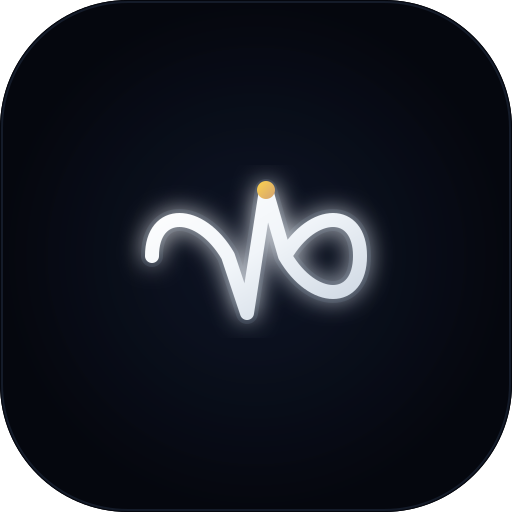

# Senswear

<p align="center">
  
</p>

<p align="center">
  <b>A premium, privacy-first personal fitness and wellness companion for Android, purpose-built for the screen-free Pebble Qore 2 band.</b>
</p>

<p align="center">
  
  
  
  
  
  
  
</p>

---

## 🌟 Overview

**Senswear** transforms the screen-free **Pebble Qore 2** wellness band into a first-class health powerhouse on Android. Combining low-latency **Direct Bluetooth Low Energy (BLE)** telemetry with **Google Health Connect**, Senswear provides an uncompromised, dark-first **Glassmorphism** experience with zero cloud lock-in, zero telemetry tracking, and total local data sovereignty.

---

## ✨ Key Features

- **Authoritative Canonical Reconciliation**: Intelligently reconciles and deduplicates data streams across Pebble BLE hardware, Google Health Connect, and onboard phone sensors.
- **Glassmorphism Design Identity**: Dark obsidian canvas with translucent glass surfaces (`SensGlassCard`, `SensGlassSurface`), subtle specular glows, smooth Bezier curves, and WCAG-compliant contrast.
- **24/7 Biometric Monitoring**:
  - **Steps & Movement**: Intraday hourly distributions, caloric burn, active minutes, and 7-day/30-day trends.
  - **Live Heart Rate & Zones**: Continuous 1-second pulse stream with animated pulse indicator, resting HR baseline, and Zone 1–5 breakdown.
  - **SpO₂ & Blood Oxygen**: Reflectance PPG tracking with 7-day history and clinical disclaimers.
  - **Heart Rate Variability (HRV)**: rMSSD measurement reflecting autonomic recovery.
  - **Sleep Architecture**: Sleep score, duration, and granular hypnogram stages (Deep, Light, REM, Awake).
  - **Autonomic Stress & Skin Temperature**: Continuous stress index and nocturnal skin temperature deviation.
- **Live Workout Tracking**: Real-time timer, HR zone monitor, pace, distance, calories, and haptic feedback alerts.
- **Device Management & Diagnostics**: Real-time battery status (up to 45 days), signal RSSI, firmware details, and a live raw BLE packet console.
- **100% Local-First & Privacy-Obsessed**: No accounts, no servers, zero analytics. Includes full one-tap JSON export and local data purge.

---

## 🏛 Architecture

```
┌────────────────────────────────────────────────────────────────────────┐
│                          Jetpack Compose UI                            │
│  (SensGlassSurface, Glass Cards, Charts, Animations, Dark Glass Theme) │
├────────────────────────────────────────────────────────────────────────┤
│                      ViewModels & UI State Holders                     │
│    (HomeViewModel, ActivityViewModel, HealthViewModel, etc.)           │
├────────────────────────────────────────────────────────────────────────┤
│                          Domain / Use Cases                            │
│ (CanonicalDataReconciler, HeartRateZones, GoalProgress, Insights)      │
├────────────────────────────────────────────────────────────────────────┤
│                       Repository Layer (Flow)                          │
│ (ActivityRepo, HealthRepo, SleepRepo, WorkoutRepo, GoalRepo, etc.)     │
├──────────────────────────────────┬─────────────────────────────────────┤
│     Local Storage Layer          │          Wearable / Health          │
│   • Senswear SQLite DB (11 tbls) │   • WearableConnector (Qore 2 BLE)  │
│   • DataStore Preferences        │   • Google Health Connect Manager   │
│   • Encrypted/Local Backup       │   • FakeQore2Connector (Debug only) │
└──────────────────────────────────┴─────────────────────────────────────┘
```

---

## 📊 Pebble Qore 2 Verification Status

See [`docs/QORE2_CAPABILITY_MATRIX.md`](docs/QORE2_CAPABILITY_MATRIX.md) for full capability details.

| Metric | Verification | Integration Path |
| :--- | :--- | :--- |
| **Steps & Distance** | **CONFIRMED** | Pebble Vendor Frame (`0xFEE0`) / Health Connect |
| **Live Heart Rate** | **CONFIRMED** | Standard GATT HR (`0x180D`, `0x2A37`) |
| **Resting HR** | **CONFIRMED** | Nocturnal Baseline Aggregation |
| **Heart Rate Zones** | **CONFIRMED** | Senswear Physiological Engine |
| **Blood Oxygen (SpO₂)** | **CONFIRMED** | Pebble Vendor Frame (`0x10`) / Health Connect |
| **HRV (rMSSD)** | **CONFIRMED** | Pebble Vendor Frame (`0x10`) / Health Connect |
| **Sleep & Hypnogram** | **CONFIRMED** | Pebble Sleep Packet / Health Connect |
| **Skin Temperature** | **CONFIRMED** | GATT Health Thermometer (`0x1809`) / Vendor |
| **Stress Score** | **CONFIRMED** | Autonomic Balance Engine |
| **Battery Health** | **CONFIRMED** | Standard GATT Battery (`0x180F`, `0x2A19`) |

---

## 🛠 Tech Stack

- **Language**: Kotlin 2.3.20
- **UI Framework**: Jetpack Compose + Material 3
- **Async & Reactive**: Kotlinx Coroutines + Flow / StateFlow
- **Persistence**: High-performance Room-backed SQLite database + DataStore Preferences
- **Health Engine**: Google Health Connect Client (`1.1.0-alpha11`)
- **Bluetooth**: Android BLE APIs (GATT Client, Central Role, Auto-reconnect)
- **Tooling**: Gradle 9.1.0, AGP 9.0.1, Compile SDK 36

---

## 🚀 Building & Running

### Requirements
- OpenJDK 17+ (or OpenJDK 21)
- Android SDK API 36 Platform & Build Tools 36.0.0

### Run Tests
```bash
./gradlew testDebugUnitTest
```

### Build Debug APK
```bash
./gradlew assembleDebug
```
The APK is generated at `app/build/outputs/apk/debug/app-debug.apk`.

---

## 📖 Detailed Documentation

- [Architecture & Design System](docs/ARCHITECTURE.md)
- [Qore 2 Capability Matrix](docs/QORE2_CAPABILITY_MATRIX.md)
- [BLE Protocol Specification](docs/BLE_PROTOCOL.md)
- [Domain & Persistence Data Models](docs/DATA_MODEL.md)
- [Health Connect Guide](docs/HEALTH_CONNECT.md)
- [Privacy Policy & Data Sovereignty](docs/PRIVACY.md)
- [Build Guide](docs/BUILD.md)
- [Testing Suite](docs/TESTING.md)
- [Changelog](docs/CHANGELOG.md)

---

## 🔒 Privacy & Legal

- **Inspiration Disclaimer**: Senswear is an original work designed independently from first principles.
- **Clinical Disclaimer**: Senswear and Pebble Qore 2 metrics are intended for general fitness and wellness monitoring and are not intended for medical diagnosis or clinical treatment.

---

## 📄 License

Senswear is open source licensed under the **Apache License 2.0**.
