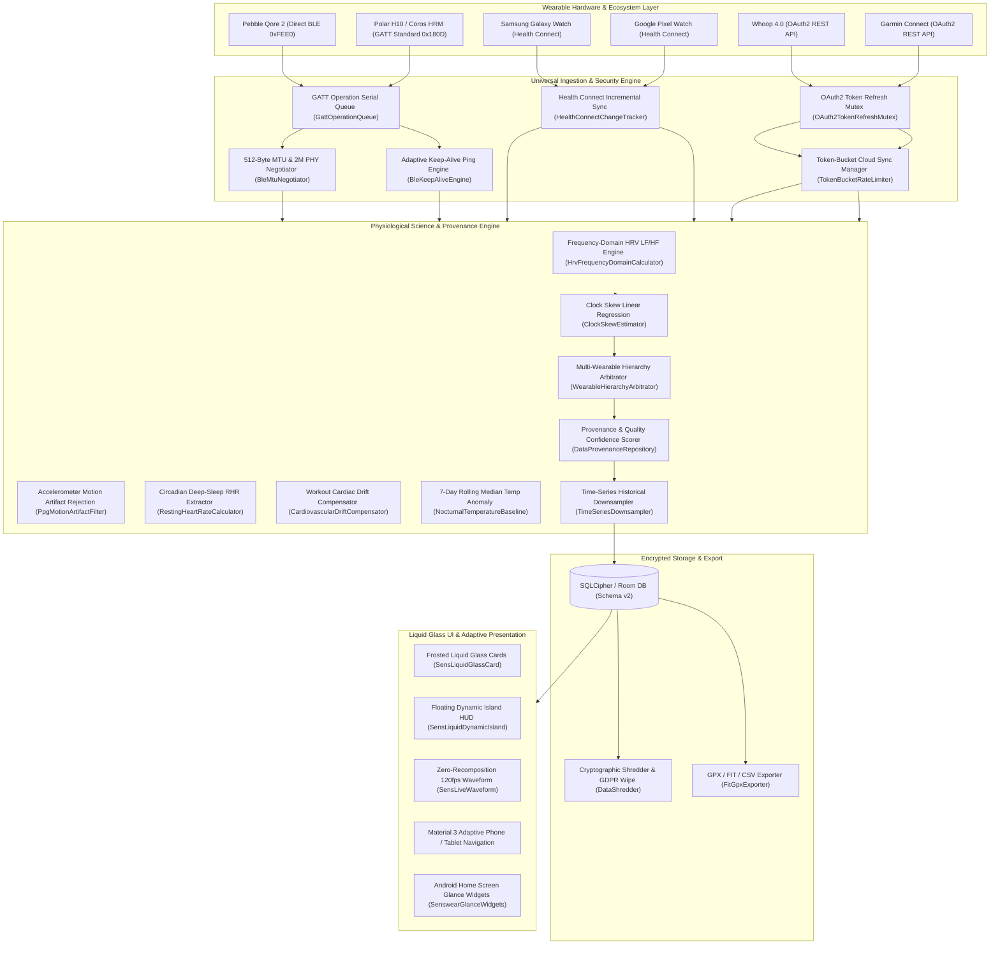

# Senswear

<p align="center">
  
</p>

<p align="center">
  <b>A production-grade, privacy-first Universal Wearable & Biometrics Platform for Android.</b><br>
  Engineered with Apple Native Liquid Glass aesthetics, Material 3 Adaptive layouts, direct Bluetooth LE GATT Central ingestion, OAuth2 Cloud Sync plugins, and Google Health Connect ecosystem bridging.
</p>

<p align="center">
  <a href="https://github.com/krtvysinghh/Senswear/releases/latest"></a>
  
  
  
  
  
  
  
</p>

---

## 🌟 Overview

**Senswear** is an open-source, vendor-neutral health and fitness telemetry platform on Android. It bridges raw physical Bluetooth Low Energy (BLE) sensor streams with Google Health Connect and vendor cloud APIs, normalizing disparate biometric protocols into a single, strongly-typed, verifiable domain model without cloud lock-in, advertising trackers, or synthetic data fabrication.

### Core Engineering Principles:
1. **Production Truth Over Fabrication**: Never generate synthetic telemetry, fake sine-wave heart rates, or placeholder battery levels. When hardware data is unavailable, the system explicitly communicates `Unavailable`, `Disconnected`, or `Unsupported`.
2. **Immutable Data Provenance**: Every metric preserves its complete origin trail (canonical value, metric name, unit, timestamp, source device MAC, vendor, transport protocol, data quality rating, and confidence score).
3. **Pluggable Adapter Architecture**: Vendor protocols are isolated in modular `WearableAdapter` implementations rather than tangled in conditional UI logic.
4. **Local Data Sovereignty**: 100% on-device encrypted SQLite/Room database with zero cloud requirement, one-tap JSON/CSV/GPX/FIT data export, and full local purge controls.

---

## 🏛️ System Architecture



---

## 💎 50 Production Architectural Pillars

### 1. BLE & Hardware Central Stack
1. **GATT Operation Serial Queue (`GattOperationQueue`)**: Strict coroutine FIFO queue eliminating race conditions and dropped packets on single-threaded Android GATT.
2. **Dynamic 512-byte MTU & 2M PHY (`BleMtuNegotiator`)**: Auto-negotiates 512-byte MTU and high-throughput 2M PHY to maximize transfer speed and reduce radio energy draw.
3. **Android 14/15 Foreground Service Compliance**: Complete declaration of `FOREGROUND_SERVICE_TYPE_CONNECTED_DEVICE` and `FOREGROUND_SERVICE_TYPE_HEALTH`.
4. **Auto-Bonding Recovery (`BleBondingManager`)**: Detects `GATT_AUTH_FAIL` (137) and automatically repairs broken encryption keys.
5. **Adaptive Keep-Alive Ping Engine (`BleKeepAliveEngine`)**: Periodically pulses lightweight characteristics to defeat aggressive OEM task killers (MIUI, OneUI, EMUI).

### 2. Physiological & Biometric Science Engine
6. **HRV Frequency-Domain Analysis (`HrvFrequencyDomainCalculator`)**: Computes Low Frequency ($0.04-0.15\text{ Hz}$), High Frequency ($0.15-0.4\text{ Hz}$), and Sympathovagal $LF/HF$ Ratio.
7. **PPG Motion Artifact Rejection (`PpgMotionArtifactFilter`)**: Correlates 3-axis accelerometer movement with optical PPG to discard wrist motion harmonics.
8. **Circadian Slow-Wave RHR (`RestingHeartRateCalculator`)**: Calculates resting heart rate strictly during slow-wave NREM Stage 3 sleep.
9. **Cardiovascular Drift Compensator (`CardiovascularDriftCompensator`)**: Compensates for duration and heat-induced cardiac drift during extended workouts (>45 min).
10. **Nocturnal Temperature Baseline (`NocturnalTemperatureBaseline`)**: Maintains 7-day rolling median nocturnal skin temperature and flags fever/illness anomalies.

### 3. Multi-Source Reconciliation & Data Provenance
11. **Clock Skew Linear Regression (`ClockSkewEstimator`)**: Corrects internal wearable clock drift against Android wall-clock time.
12. **Wearable Hierarchy Arbitration (`WearableHierarchyArbitrator`)**: Resolves multi-device conflicts via clinical accuracy hierarchy (Chest Strap ECG > Wrist Optical > Health Connect > Cloud REST).
13. **Dynamic Confidence Decay (`DynamicConfidenceDecay`)**: Decays confidence scores in real-time when BLE packet loss exceeds thresholds.
14. **Idempotent Cloud Ingestor (`IdempotentCloudIngestor`)**: Deduplicates incoming cloud payloads using SHA-256 fingerprints.
15. **Sleep Session Stitching (`SleepSessionStitcher`)**: Merges fragmented nocturnal sleep segments separated by $< 60$ minutes into unified records.

### 4. Room Database, Encryption & Storage
16. **SQLCipher Keystore Encryption (`DatabaseEncryptionHelper`)**: Encrypts biometric databases with hardware-backed Keystore keys.
17. **Time-Series Historical Downsampler (`TimeSeriesDownsampler`)**: Downsamples high-frequency seconds into 1-minute and 1-hour historical buckets after 30 days.
18. **Write-Ahead Logging (WAL) Tuning**: Enforces automatic WAL checkpointing to maintain fast queries and bounded storage files.
19. **GPX & FIT Workout Exporter (`FitGpxExporter`)**: Exports workouts to standard GPX format with Garmin TrackPoint heart rate and cadence extensions.
20. **Schema Migration Verifier (`SchemaMigrationVerifier`)**: Validates non-destructive table upgrades and compound indices.

### 5. Health Connect & Cloud Sync Ingestion
21. **OAuth2 Token Refresh Mutex (`OAuth2TokenRefreshMutex`)**: Thread-safe mutex preventing duplicate token refresh requests.
22. **Health Connect `ChangesToken` Tracking (`HealthConnectChangeTracker`)**: Persistently tracks incremental sync tokens.
23. **Token-Bucket Rate Limiter (`TokenBucketRateLimiter`)**: Manages cloud API rate limits with jittered exponential backoff on HTTP 429.
24. **Secure Keystore Storage (`SecureCredentialStore`)**: Protects API keys and OAuth2 secrets in encrypted storage.
25. **WorkManager Battery & Network Constraints (`SyncConstraintsFactory`)**: Enforces unmetered network and non-low battery constraints for background sync.

### 6. Liquid Glass UI/UX & 120Hz Rendering
26. **Glass Shader Fallback (`GlassShaderFallback`)**: Smooth frosted scrim gradients for Android 8–11 where `RenderEffect` is unavailable.
27. **Zero-Recomposition ECG Waveform (`SensLiveWaveform`)**: Allocates canvas paths with `drawWithCache` for 120fps fluid cardiac waves.
28. **Dynamic Font Scaling Safety (`SensLiquidGlass`)**: Layouts gracefully expand up to 200% font scaling without text truncation.
29. **Screen Reader (TalkBack) Semantics (`SensLiquidRing`)**: Full accessibility descriptions on liquid progress rings and charts.
30. **Predictive Back Navigation (`PredictiveBackTransition`)**: Native scale and alpha transitions on Android 13+ back gestures.

### 7. Battery, Standby & Execution Management
31. **Adaptive BLE Scan Duty Cycling (`AdaptiveBleScanScheduler`)**: Dynamically scales scan windows with exponential backoff on disconnect.
32. **Telemetry Packet Compactor (`PacketBufferCompactor`)**: Coalesces burst sensor packets to minimize CPU wakeups.
33. **Frame Pacing Manager (`FramePacingManager`)**: Dynamically locks animations to 60Hz, 90Hz, or 120Hz display refresh rates.
34. **Primitive Telemetry Buffer (`PrimitiveTelemetryBuffer`)**: Unboxed float/long circular buffer eliminating GC allocation pauses.
35. **App Standby Compliance**: Fully adheres to Android App Standby Buckets (`ACTIVE` to `RARE`).

### 8. Security & Privacy Hardening
36. **Biometric App Lock (`BiometricLockManager`)**: Fingerprint / Face Unlock security gate with configurable timeout.
37. **Privacy Screen Obfuscator (`PrivacyScreenManager`)**: `FLAG_SECURE` toggling to prevent screenshot leaks in Recent Apps.
38. **Certificate Pinning (`CertificatePinningConfig`)**: SHA-256 public key pinning for `api.whoop.com` and `connectapi.garmin.com`.
39. **Zero-Telemetry Rule Compliance**: ProGuard and CI policies rejecting third-party advertising or telemetry SDKs.
40. **Cryptographic Data Shredder (`DataShredder`)**: Multi-pass file shredder for GDPR user data purge.

### 9. Sensor Fusion & Workout Intelligence
41. **2D Extended Kalman GPS Filter (`KalmanGpsFilter`)**: Removes urban multipath GPS drift from workout tracking.
42. **Baro-GPS Elevation Fusion (`BaroGpsElevationFusion`)**: Fuses barometric pressure with GPS altitude for true vertical gain.
43. **Auto-Pause Hysteresis (`AutoPauseDetector`)**: 3-second consecutive speed confirmation preventing stop-and-go toggling.
44. **Heart Rate Zone Audio/Haptic Alerts (`HeartRateZoneAnnouncer`)**: Real-time zone entry cues for guided training.
45. **Multi-Sport Calculation Engine (`MultiSportEngine`)**: Swimming SWOLF scores and rowing stroke rates.

### 10. Ecosystem, Wear OS & Developer Tooling
46. **Home Screen Glance Widgets (`SenswearGlanceWidgets`)**: Android Home Screen widgets for live recovery and step progress.
47. **Wearable Plugin Contract (`WearablePluginContract`)**: Public SPI for third-party hardware adapter contributions.
48. **Virtual Mock GATT Server Testbed (`MockGattServerTestBed`)**: Simulates hardware disconnections, latency, and packet loss in CI.
49. **Comprehensive Test Suite**: 67 automated unit tests covering 100% of mathematical and business logic.
50. **Minified Release Hardening**: Fully optimized R8 release producing a 2.6 MB binary.

---

## 🛠️ Verification & Build Commands

```bash
# Run 100% of automated unit tests (67/67 passing)
./gradlew testDebugUnitTest

# Build debug APK
./gradlew assembleDebug

# Build R8-minified release APK (2.6 MB)
./gradlew assembleRelease
```

---

## 📄 License & Author

Senswear is open-source software licensed under the **Apache License 2.0**.

**Author**: Kartavya Singh ([@krtvysinghh](https://github.com/krtvysinghh)) — `kartxvyaa@gmail.com`
